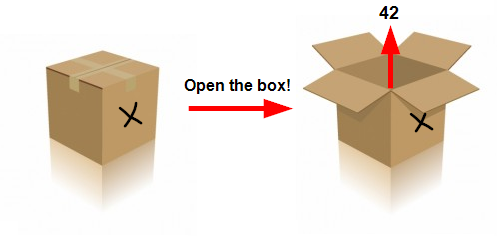
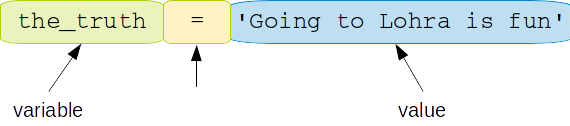
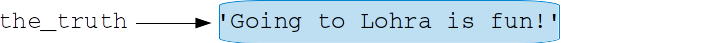
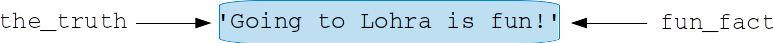
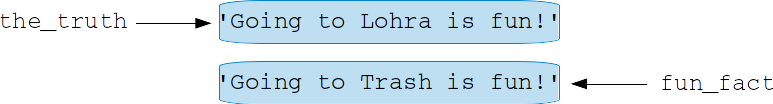
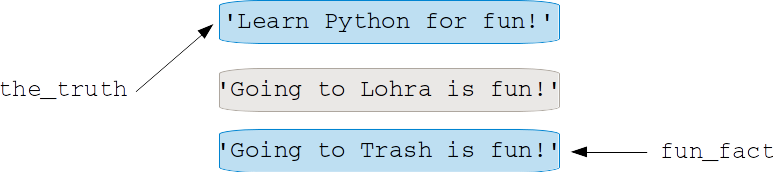
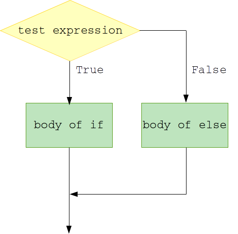
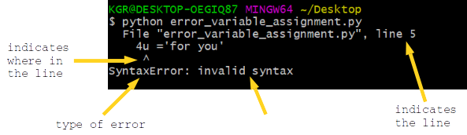

---
title: Variables, Assignments and If-statements
date: Apr 10, 2019
...

# Basic Programming in Python

## About me

{width=70%}


::: notes
  - master student first semester
  - studied here in my Bachelors
  - really looking forward to teaching this course
  - I also was a beginner when I started my Bachelors
  - can understand if learning how to code can be intimidating at first
  - will learn programming by programming
  - will be very useful for your whole studies
  - ask if any question, don't hesitate!
  - I am happy help you
  - especially if you just started your Masters here, you can also ask me about other orga stuff
:::


## Feedback sessions and Practice sessions

### Feedback sessions
- are great for getting individual feedback
- e.g. discuss new concepts
- sign up on StudIP

### Practice sessions
- you are welcome to come to the practice session any time
- you can collaborate with your fellow students
- we are there to give you guidance on the current homework


# What are variables?
## What is a variable?

{width=60%}
@mv_code_club2019

- you can "store" a value in a variable
- variables are placeholders
- values are the contents


::: notes
A variable is a placeholder for a concept.
The value that you can assign to it, is its realization.

You can think of a variable as a box.
The value (that is assigned to it) is its content.
:::


## Assigning a value to a variable

- we use the `=` operator to assign a value to a variable \vspace{2em}

{width=90%}


::: notes


On the left side of the assignment operator (`=`) is the **variable name** (`the_truth`).

On the right side is the **value** of the variable (`'Going to Lohra is fun!'`)
:::


## Assigning a value to a variable

### Caution

\begingroup\centering

`=` in code (denoting assignment)

is **not** the same as

$=$ in math (denoting equality)

\endgroup


::: notes
In code, the right side of the equal sign is assigned to the variable left to the equal sign.

In math, the left and the right side of the equal sign must be equal.
:::


## Variables in Python

- variables are created when they are first assigned

- variables must be assigned before you use them


## Let's print the variable

```{.python .exec}
the_truth = 'Going to Lohra is fun!'

print(the_truth)
```


::: notes
- First we assign the string `'Going to Lohra is fun!'` to the variable `the_truth`.
- To print the content of the variable to the command line, we use the print function that you got to know in the last lecture.
:::


## Variable assignment

```python
the_truth = 'Going to Lohra is fun!'
```




## Assigning a variable to another variable

```python
the_truth = 'Going to Lohra is fun!'
fun_fact = the_truth
```




## Variable assignment

```python
the_truth = 'Going to Lohra is fun!'
fun_fact = the_truth
fun_fact = 'Going to Trash is fun!'
```




## Variable assignment


```python
the_truth = 'Going to Lohra is fun!'
fun_fact = the_truth
fun_fact = 'Going to Trash is fun!'
the_truth = 'Learn Python for fun!'
```




## Recap: string concatenation

```python
who = 'Most Coxis think: '
the_truth = 'Going to Lohra is fun!'

# intended output on the command line:
# Most Coxis think: 'Going to Lohra is fun!'

# your code goes here
```

:::notes

- a line in your script that begins with `#`, is a comment

- the comment is not executed when you run your script

- strings can be enclosed by single quotes or double quotes
:::


## Recap: string concatenation


```{.python .exec}
who = 'Most Coxis think: '
the_truth = 'Going to Lohra is fun!'

print(who + "'" + the_truth + "'")
```

:::notes

- we can use the `+` operator to concatenate two strings  

- the comment is not executed when you run your script
:::


## print()

```{.python .exec}
answer = 'We are learning'
language = 'Python.'

print(answer + " " + language)
print()
print(answer, language)
```

:::notes

To print the string `We are learning Python.`, you can either use string concatenation (`+`) inside the print function

or

you can separate the variables that you want to print with a comma.
Note that in this case there are spaces between the variables in the output.
:::


## Variable naming rules in Python

- variable names
  - can be of any length,
  - can contain uppercase and lowercase letters (A-Z, a-z),
  - digits (0-9),
  - and the underscore character (\_).
\vspace{2em}

### Caution
The first character of a variable name cannot be a digit!

::: notes
## How to use PINGO?

1. use your smartphone or laptop

2. type in the session number

3. answer the question

Type in the session number: 203586
:::


## Conventions

- choose meaningful variable names
- do not begin variable names with a capital letter
  - capital letters are reserved for other things (convention)
  - more about this in the next weeks


## Conventions

```{.python .exec}
# do not do this
var_1 = '12.04.2019'
x = '14.04.2019'

print('Lohra is from ' + var_1 + ' to ' + x)
```

## Conventions

```{.python .exec}
# do this
# give your variables descriptive names
start_date = '12.04.2019'
end_date = '14.04.2019'

print('Lohra is from ' +  start_date
      + ' to ' + end_date)
```

##

- make long variables readable by using snake_case

- snake_case means that each word is separated by an underscore \vspace{1em}

  ```python
  total_number_of_participants_lohra = 958
  ```


# What is a data type?
## What is a data type?

- defines how the value of the variable is stored

- defines which operations are valid for the variable

::: notes
In Python, every value has a data type.
There are several data types in Python.
In this lecture, we will learn about strings, integers, floats and booleans.
:::


## Data types in Python

- the data type of a variable is interpreted based on the value that is assigned to the variable

- there is no explicit declaration of a data type for a variable

- use the `type()` function to check the type of a variable \vspace{2em}

::: notes
In Python, you do not have to declare the data type of a variable explicitly.
The data type of a variable will be interpreted based on the value that is assigned to it when you run your code.
That means that the data type of a variable can change while running a script.
:::

##

```{.python .exec}
# the variable is a string.
ultimate_answer = 'forty-two'
print('The answer is', ultimate_answer)
print('The type is', type(ultimate_answer))
```

##

```{.python .exec}
# the variable is an integer
ultimate_answer = 42
print('The answer is', ultimate_answer)
print('The type is', type(ultimate_answer))
```

##

```{.python .exec}
# the varibale is a float
ultimate_answer = 42 + 0.0
print('The answer is', ultimate_answer)
print('The type is', type(ultimate_answer))
```

:::notes
Note that Python does implicit conversion if possible.
:::


## Data types in this lecture

|                  | Type  | Description                    | Example   |
|------------------|-------|--------------------------------|-----------|
| Integer          | int   | integer of arbitrary magnitude | x = 1     |
| Float            | float | floating-point number          | x = 1.0   |
| String           | str   | character string               | x = 'one' |
| Boolean          | bool  | boolean value                  | x = True  |


::: notes
In the following weeks, you will get to know more data types like Lists or Dictionaries.
:::


## Operations on data types

Subtraction is a valid operation on two integers.

```{.python .exec}
to_be_paid = 12
given_cash = 15

money = given_cash - to_be_paid
print('The cashier will give you', money, 'Euros.')
```

## Operations on data types

Subtraction is an invalid operation between an integer and a string.

```{.python .exec}
to_be_paid = '12'
given_cash = 15

money = given_cash - to_be_paid
```


## Casting

```{.python .exec}
to_be_paid = '12'
given_cash = 15

money = given_cash - int(to_be_paid)
print('The cashier will give you', money, 'Euros.')
```

:::notes
You can change the type of a variable with a so-called cast operation.

That only works if Python knows how to convert the previous type into the other type!

You can cast with functions like:

  - int()
  - str()
  - float()
:::


## The Boolean data type  - True or False

**With a Boolean you express truth values:**
\vspace{1em}

  something is `True`    
  (which corresponds to `1`)

  or

  something is `False`    
  (which corresponds to `0`)

\vspace{2em}
  ```python
  light_on = True
  light_of = False
  ```

:::notes
### Caution
Pay attention to the correct spelling of `True` and `False`.
Both keywords begin with a capital letter followed by lower case letters.
:::


## Checking if a statement is True or False

```python
>>> 10 == 10
True
```
```python
>>> 1 > 2
False
```
```python
>>> 2 != 2
False
```
```python
age = 14
>>>  12 < age < 20
True
```

:::notes
**Operators for comparisons**

Operator Comparison            `True`         `False`
-------- --------------------- -------------- ---------
`==`     equal                 `1 == 1`       `5 == 3`
`!=`     not equal             `2.3 != 2.313` `5 != 5`
`<`      less than             `2.5 < 9`      `4 < 3`
`>`      greater than          `2.4 > 2.399`  `0.1 > 5`
`<=`     less than or equal    `3 <= 3`       `4 <= 3`
`>=`     greater than or equal `2.4 >= 2.399` `0 >= 5`
:::


# How to write if-statements?
## How to make conditional statements?

{width=50%}


:::notes
Sometimes you want to execute code depending on whether a condition is met or not.
For this, we can use so called if-statements.

- if the condition after the keyword `if` evaluates to `True`,
the body of the if-statement is executed

- otherwise (`else`), the body of the else-statement is executed
:::


## If - statements

```python
age = 14

if age == 14:
    print('You are 14 years old!')

if 13 <= age <= 19 :
    print('You are a teenager.')
else:
    print('You are not a teenager.')
```

:::notes
- to create an if-statement, we use the keyword `if`

- same indentation --> block of code
- we indent by using 4 spaces
:::

##
```{.python .exec}
age = 14

if age == 14:
    print('You are 14 years old!')

if 13 <= age <= 19 :
    print('You are a teenager.')
else:
    print('You are not a teenager.')
```


# How to deal with errors?
## Errors

- everyone makes mistakes when writing code


::: notes
Even the most experienced programmers make errors in their code.
When running code, you will also receive error messages and need to debug your code.
Error messages are great as they can often help us to spot the mistakes more easily and give
hints where to start debugging.

- logical mistakes
  - your program does not do what it is supposed to do
  - you might notice because you see an unexpected result
  - worse: you trust your output but it was wrongly derived
    --> testing your code can help (more on this in the next weeks)

- syntax mistakes
  - similar to making an 'orthographic mistake'

--> understanding error messages is very helpful to spot and fix the mistakes
:::


## Example error


```python
# this is a valid Python statement
goodn8 = 'sleep well'

# this is an invalid Python statement
4u ='for you'
```

:::notes
What is wrong with this piece of code?
:::


## Example traceback


```{ .python .exec}
# this is a valid Python statement
goodn8 = 'sleep well'

# this is an invalid Python statement
4u ='for you'
```

:::notes
Let's have a look at the traceback:

- what type of error is it?

- what is the problem?


Traceback: The sequence of function calls that led to an error.
:::


## Reading the traceback



:::notes
- a variable name must not start with a number
:::


## SyntaxError

 - your code cannot be interpreted

 - similar to making an 'orthographic mistake'


 --> did you only use valid Python statements?


## Different types of errors

- SyntaxError

- NameError

- ValueError

- TypeError

\vspace{3em}

You will learn about these type of errors on the exercise sheet


:::notes
**NameError**

- occurs when you use a variable that did not exist before

**ValueError**

- occurs when a function (more about this in the next lecture) is given an inappropriate value

**TypeError**

- occurs when a operation is used with inappropriate variable types
:::


## Tips for the homework

- to understand what code does

  - try to run it   --> what is the output/error?

  - try to change some variable --> how does the output change?


- using a search engine is **no** cheating!

- collaborate with your peers!


::: notes

Recap PINGO

- start session 203586


Homework

- looks much to do at first, but if you go step by step I am sure, you will do great

- biggest hint for almost all the exercises: run the code!!

- play around with code!
:::

##

:::notes
Exercise 2.2

- copy the code to a python script

- add your lines of code below

- you could define a variable called total_price_apples

- assign it a value using the previously defined varibles

- do not forget to print your result to the command line
:::


## 


:::notes
Exercise 3.3

- make a plan: what should be the output of your program?

- is there a condition that you have to check?

- look up the notes on the comparison operator slide

- define a variable at the top of your script that is the number that you want to check

- by determining, it is meant that you print to the command line whether the number defined above is positive or negative
:::


## See you tommorow!

I hope to see you in the practice session tomorrow!