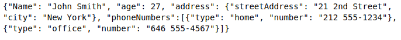

---
title: File Input/Ouput
date: Feb 15, 2019
...

# Recap


## General Tips

- submit executable code

- read the error messages

- have a look at the corrections

::: notes
Try to make your code runnable.
It’s okay if there are logical errors, but you are able to read and fix SyntaxErrors since the second lecture.
You will not get more than 50% of the points for a task if your code cannot be executed. This will be handled more strictly every week.
In the last week you will not get more than 25% of the points for a task if your code cannot be executed.
:::


## PINGO

What do you think will be the output of this? \vspace{1em}

```python
print(1, 2, 3, sep="*", end="!")
```

::: notes
Note how there are no spaces around the equal signs for the keyword arguments.
:::


## Recap: print() revisited

```{ .python .exec wd=06_FileIO }
print(1, 2, 3, 4, sep='*')
print(1, 2, 3, 4, sep='#', end='&')
```

:::notes
The `sep` argument is by default space for the `print()` function. In this case we set it to `*` or `#`.
:::


## Recap: String Operations

```{ .python .exec wd=06_FileIO }
text = "Lara Meier\nAnna Müller\nJana Schmidt"
print(text)
```


## Recap: split()

```{ .python .exec wd=06_FileIO }
text = "Lara Meier\nAnna Müller\nJana Schmidt"

# split between each first and last name
names = text.split()
print(names)
```

:::notes
`split()`: splits a string into a list of strings (by default it splits at whitespace).
:::


## Recap: splitlines()

```{ .python .exec wd=06_FileIO }
text = "Lara Meier\nAnna Müller\nJana Schmidt"

# splits between each name
names = text.splitlines()
print(names)
```

:::notes
`splitlines()`: splits a string at each line break into a list of strings.
:::


## Recap: Python 3 Cheat Sheet

\center{\textbf{$\rightarrow$ you learned a lot!}}

::: notes
{width=70%}
:::


# I/O Streams

## By the end of this lecture you will know how to ...

- read in text files

- write to text files

- work with `csv` files

::: notes

- csv stands for comma separated values (more about this later)
:::


## Kinds of Files

**Text files**

- made of readable text characters \vspace{1.5em}


**Binary files**

- contain unformatted data, saved in its raw memory format


::: notes
**Binary files**

contain unformatted data, saved in its raw memory format. They are computer- but not human-readable.
For example, the integers 1, 351, 473829 are all stored as 4 or 8 byte integers while their string representations would be 1, 3 and 6 byte values. The details are not important for this course.
:::


## Keyboard Input

- keyboard input is nice to interact with the user

 `answer = input("What is your name? ")` \vspace{2em}


**But how to work with a lot of data?**

$\rightarrow$ you will need to read data from files and save data to files


## Why do we need to learn how to work with files?

- to handle large amount of data

- to export data from a database

- to use data as input to another program

::: notes
For example:

- conducting an experiment (storing the records of the participants)

- downloading data sets
:::


## Input Output Streams

- I/O stands for _Input and Output_


::: notes

We already got to know an output stream:

The standard output stream (`stout`)

- we use the `print()` function to output data to the standard output device (screen)

- we can also use the print function to write data to a file (will be discussed later)
:::


## Streams

"In computer science, a stream is a sequence of data elements made available over time"

@wiki:stream \vspace{1em}

- `stdin`

- `stdout`

- `stderr`


::: notes
A stream can be thought of as items on a conveyor belt being processed one at a time rather than in large batches (@wiki:stream). There are three standard streams that are supported by most programming languages and connect the program with its environment:

- **Standard input stream (`stdin`)**
    - leads data into an application
    - usually this data comes from the keyboard or other hardware

- **Standard output stream (`stdout`)**
    - leads data out of an application
    - usually to the terminal

- **Standard error stream (`stderr`)**
    - leads error-/diagnostics data out of an application
    - usually this also goes to the terminal
:::


## Standard Output Stream

```python
import sys

print(*objects, sep=' ', end='\n', file=sys.stdout)
```

Have a look at the Python 3 Documentation [**here**](https://docs.python.org/3/library/functions.html#print).

::: notes
`print(*objects, sep=' ', end='\n', file=sys.stdout)` \vspace{1em}

With the `print()` function, you print objects

\quad \quad to the stream `file`,

\quad \quad separated by `sep`

\quad \quad and followed by `end`. \vspace{1em}

`sep`, `end` and `file` must be given as keyword arguments. \vspace{2em}
:::


# Opening and Closing a File

## Opening, Printing to and Closing a File

```{ .python .exec wd=06_FileIO }
# initializing my lottery numbers
numbers = [21, 8, 19, 9, 1, 22]

# opening the file in write mode
lottery_file = open('lottery.txt', 'w')
# printing data to the file
print(numbers, file=lottery_file)
# closing the file
lottery_file.close()
```

::: notes
After opening a file, you can use `print()` with the file as a keyword argument to write to the file.
Opening a file technically means creating a stream such that data is able to flow from the file to the application or vice versa.

Files that are opened need to be closed after use.
The data stream needs to be closed down to confirm that no more data will be transferred, to free up resources that were made available for the stream, and to make the file accessible for other processes.
:::


##

```python
# initializing my lottery numbers
numbers = [21, 8, 19, 9, 1, 22]

# taking care of opening and closing
with open('lottery.txt', 'w') as lottery_file:
    # printing data to the file
    print(numbers, file=lottery_file)
```

::: notes
There is another notation that makes the opening **and** closing of files easier:
using a **`with`** statement.

The `with` statement calls a context manager.
The context manager handles the opening and closing of the file for you.
Using this notation is heavily recommended and common practice.


We recommend that you only use `open()` and `close()` manually if you cannot do it otherwise.


**Pathvariables:**
You can always assume we have the files in the same directory as the scripts (unless otherwise mentioned), so just use the filenames.
:::


## Writing to a File

{width=100%}


## File Modes


| Mode | Description                                             |
|------|---------------------------------------------------------|
| r    | To read a file (default)                                |
| w    | To write a file; Creates a new file if it doesn’t exist |
| a    | To append at the end of file; create if doesn’t exist   |
| +    | To open a file for updating (reading or writing)        |

::: notes
File modes: the letter after the `file name` is the mode.
It can be one of:

- `w` write (overwrites/creates)

- `r` read (read-only)

- `a` append (updates/creates)

- add `+` to open for read and write (e.g. `r+`)

- some more that we are not going to cover in this lecture
:::


## File Modes

{width=90%}

::: notes

- opening a file for reading should be done with mode `r`.

- if you open a file with `w`, it is cleared.

- if you want to avoid clearing but still write, use `a` for appending

- or, if you want read and write, use `r+`
:::


# Reading from and Writing to a File

## Reading in Data from a File


```{ .python .exec wd=06_FileIO }
# taking care of opening and closing (file mode: read)
with open('greeting.txt', 'r') as greet_file:
    print(greet_file.read())
```

::: notes
The code works given the file `greeting.txt` (like the one we created on previous slides) exists. \vspace{1em}


To read from a file we use `read()`.

When we give `read()` an argument i.e. `read(n)`, we only read the first `n` characters.
For example `read(5)` reads the first 5 characters.
:::


## Writing to a File 

```{ .python .exec wd=06_FileIO }
text = "Lara Meier\nAnna Müller\nJana Schmidt"

with open('names.txt', 'w') as name_file:
    # writing the names to a file
    name_file.write(text)
```

::: notes
To write to a file we use `write()` and give it the string, that we want to write to the file, as an argument.


In this example, we open the file in `'w'` mode.  If a file with the name `names.txt` does not exist yet, a new one is created and we write the `text` string into it. If the file `names.txt` did exist beforehand, the file `names.txt` is cleared and we write the `text` string into it. As we do not direct any data to the standard output stream, there is nothing displayed on the terminal.
:::


## Reading a File Line by Line

```{ .python .exec wd=06_FileIO }
# taking care of opening and closing (file mode: read)
with open('names.txt', 'r') as names_file:
    # make a list of each line of the file
    name_records = names_file.read().splitlines()
    for line in name_records:
        print(line)
```

::: notes
The code works given the file `names.txt` (like the one we created on previous slides) exists. \vspace{1em}

In this example, we want to print the names from the file to the terminal.
:::


## Reading a File Line by Line

```{ .python .exec wd=06_FileIO }
# we want to have a list of the last names

with open('names.txt', 'r') as names_file:
    lastnames = []
    for name in names_file:
        first_and_last = name.split()
        lastnames.append(first_and_last[1])
    print(lastnames)
```

::: notes
The code works given the file `names.txt` (like the one we created on previous slides) exists. \vspace{1em}

We want to make a list of the last names that we find in the file `names.txt`.

The code shows that you can also iterate over a file line by line.
:::


## Where does reading a file begin?

```{ .python .exec wd=06_FileIO }
with open('names.txt', 'r') as names_file:
    names = names_file.read().splitlines()
    names_again = names_file.read().splitlines()

print(names)
print(names_again)
```

::: notes
The code works given the file `names.txt` (like the one we created on previous slides) exists. \vspace{1em}

The code shows that you have to keep in mind where you begin reading a file and until which point you already read the data.
You can use `seek` to have more control about this (which will not be covered further in the lecture).
Have a look at the diagram on slide 21 to learn more about this.
The position where you begin reading depends on the file mode in which you open the file.
:::


## Writing Data to a File

```{ .python .exec wd=06_FileIO }
# list of lottery numbers
numbers = [21, 8, 19, 9, 1, 22]

with open('lottery.txt', 'w') as lottery_file:
    lottery_file.write(numbers)
```
What do we learn from this?


::: notes
In this example, we want to write the `list` of lottery numbers to the file.
From the error message, we learn that the argument that we pass to the function `write()` needs to be a string.


Ok, so let's correct that!
:::


## Writing Data to a File

```{ .python .exec wd=06_FileIO }
numbers = [21, 8, 19, 9, 1, 22]

with open('lottery.txt', 'w') as lottery_file:
    # we cast the number list into a str
    lottery_file.write(str(numbers))

with open('lottery.txt', 'r') as lottery_file:
    result = lottery_file.read()
    print(result, type(result))
```

::: notes
Great! Writing the list of lottery numbers to the file worked.

By looking at the output, we also find out that when we use `read()` to read in the data from a file, we get a string back.

But of course we want to continue working with a `list`.
:::


## There are only Strings ...

```python
>>> b = "[1, 2]"
>>> print(b)
[1, 2]
```
\vspace{1em}

**Casting to a list?**
```python
>>> a = list(b)
>>> print(a)
['[', '1', ',', ' ', '2', ']']
```

::: notes
First try: casting

By trying to cast the string `"[1, 2]"` to a list, we get a list with has several items of the type string.

This is not what we wanted.
:::


## Reconstructing Data Structures from Files

```{ .python .exec wd=06_FileIO }
lottery_raw = "[21, 8, 19, 9, 1, 22]"
no_brackets = lottery_raw[1:-1]
numbers_strings = no_brackets.split(',')

numbers = []
for num in numbers_strings:
    numbers.append(int(num))

print(numbers)
```

::: notes
Therefore, we need to find a way how to reconstruct a data structure from a string.

First, we remove the brackets.
Then, we split the string at each comma.
So now we have a list of the numbers (which are still strings) stored in the variable `numbers_strings`.
Lastly, we iterate over the list and cast each item to integer.
:::


## Pingo make a List Comprehension!

We can also use a list comprehension to reconstruct the list. \vspace{1em}

```python
lottery_raw = "[21, 8, 19, 9, 1, 22]"

# TODO: your code goes here

print(numbers)
```

::: notes
Using the list comprehension is is equivalent to using the code from the previous slide, but shorter to write.
:::


# Comma Separated Value Files

## Comma Separated Value Files

{width=30%}

**Kaggle avocado data set (redacted)**

```
,Date,AveragePrice,Total Volume,year,region
0,2015-12-27,1.13,450816.39,2015,Boston
1,2015-12-20,1.07,489802.88,2015,Boston
2,2015-12-13,1.01,549945.76,2015,Boston
```

::: notes
You can open csv files with:

- gedit

- atom

- LibreCalc

- and many other applications \vspace{2em}

Kaggle avocado data set: https://www.kaggle.com/neuromusic/avocado-prices

The avocado image can be found here: https://pixabay.com/images/id-3651037/
:::


## CSV Files

- no unified rules

- usually: first line states the column names

- subsequent lines are the data values

- often the data values are separated by commas (,)

    - separators are called **delimiters**

    - other common separators: semi-colon (;), tab (\\t) and colon (:)


## CSV Files

Our redacted csv file only contains these four lines: \vspace{1em}

```
,Date,AveragePrice,Total Volume,year,region
0,2015-12-27,1.13,450816.39,2015,Boston
1,2015-12-20,1.07,489802.88,2015,Boston
2,2015-12-13,1.01,549945.76,2015,Boston
```


## CSV Files

```{ .python .exec wd=06_FileIO linelength=100 }
import csv

with open('avocado.csv', 'r') as f:
    records = f.read().splitlines()
    for line in records:
        print(line.split(','))
```

::: notes
Our own csv file parser.
:::


## CSV Files

- you do not have to write your own csv file parser

- we will use the python csv library \vspace{1em}

```python
import csv
```

::: notes
If we would use `read()` we would get a long string. To work with the data, we would need to retrieve the information from that string e.g. by splitting the string, and storing them in a data structure. We do not have to write this parser as there exists a python csv library which helps us reading csv files.

In lecture 10 we will cover the details of what libraries, modules and imports are and what they do,
right now the only thing you have to remember is that you type `import csv` at the beginning of your python script to be able to work with all the functions from the csv library.
:::


##

```{ .python .exec wd=06_FileIO linelength=120 }
import csv

with open('avocado.csv', 'r') as f:
    records = csv.reader(f)
    for line in records:
        print(line)
```
::: notes
Like this we do not have to use `strip()` and `splitlines()` in order to get a list for each line of the file.

When we iterate over `csv.reader(f)` we get the row data as a list.
:::


## CSV Files

```{ .python .exec wd=06_FileIO linelength=120 }
import csv

with open('avocado.csv') as f:
    records = csv.DictReader(f, delimiter=',')
    for row_dict in records:
        print(row_dict)
```

::: notes
Using the `DictReader` the information from the header (first line) is used to make a dictionary from each row.
Each dictionary has the column name as the key and the value of that row as a value.
:::


## Processing Data from CSV Files

```{ .python .exec wd=06_FileIO linelength=120 }
import csv

with open('avocado.csv') as f:
    records = csv.DictReader(f, delimiter=',')
    prices = []
    for row_dict in records:
        prices.append(float(row_dict['AveragePrice']))
    average = sum(prices) / len(prices)
    print("The average price of our records is", average)
```

::: notes

We want to calculate the average of the AveragePrice of our three records.

We know that that means summing up the individual prices of each week and dividing this sum by the number of weeks we take into account.
Therefore, it is nice to make a list of the prices (we can easily sum up the items and evaluate how many items there are in the list).
To get this list, we iterate over the records and extract the value that is stored at the key `'AveragePrice'`. As we want to do arithmetics, we cast the values to `float`.
:::


##

```{ .python .exec wd=06_FileIO linelength=100 }
import csv

with open('my_avocado_prices.csv', 'w') as f:
    header = ['Date', 'price', 'year', 'region']
    writer = csv.DictWriter(f, fieldnames=header)
    writer.writeheader()
    writer.writerow({'Date': "2019-05-15",
                    'price': 1.29,
                    'year': 2019,
                    'region': "Niedersachsen"})
```

::: notes

We can use the `DictWriter` to write data to a file in the `csv` format.

First, we have to specify the header i.e. fieldnames. Then we can pass a dictionary to the function `writerow()` to write our data into the file.
Don't forget that you have to open the file in `'w'` mode.
:::


##

```{ .python .exec wd=06_FileIO linelength=55 }
import csv

with open('my_avocado_prices.csv') as f:
    records = csv.DictReader(f, delimiter=',')
    for row_dict in records:
        print(row_dict)
```

::: notes
If we save some more data, we can have our own avocado data set.
:::


# Java Script Object Notation Files 

## JSON files

- **J**ava**S**cript **O**bject **N**otation

- standardized data exchange format

- there is a python library for JSON \vspace{2em}


### JSON

- is text written with JavaScript object notation

- it has attribute–value pairs

::: notes
Same idea as csv files: we want to store and exchange data.

To import the JSON library you put `import json` at the top of your script.
:::


## JSON File Example

{width=100%}

:::notes
@wiki:json
:::


## 

{width=65%}

::: notes

- unordered set of name:value pairs
- begins with `{` and ends with `}`
- name/value pairs are separated by `,`

:::


## Recap Pingo

Suppose x is defined as follows:

```python
x = ['a', 'b', {'foo': 1, 'bar': {
    'x': 10, 'y': 20, 'z': 30}, 'baz': 3}, 'c', 'd']
```

What is the expression involving x that accesses the value 30?


## Tips for the Homework


::: notes
Make a plan for exercise 3.1

What steps do you need?

- collected ideas on the black board

:::


## References

A special thanks to the lecturers from 2017 (Aline Vilks and Sebastian Höffner) and 2018 (Antonia Hain, Moritz Nipshagen) of the course 'Basic Programming in Python' for letting me use their lecture material.


::: notes

List comprehension from PINGO

`[int(num) for num in lottery_raw[1:-1].split(',')]` \vspace{2em}


Accessing the value 30 PINGO

`x[2]['bar']['z']` 
This isn’t the only possible solution, of course.
For example, `x[-3]['bar']['z']` would also work.
:::