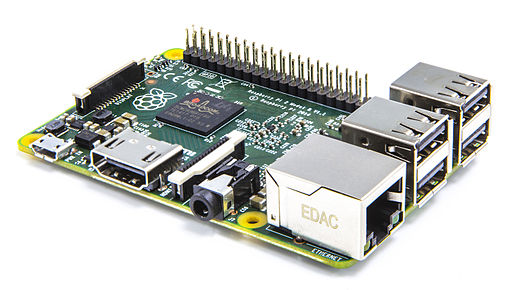

---
title: Recap
date: Jun 12, 2019
...


# Programming Project

## Your own Programming Project

- is worth 2-3 homework points

- you can do work in groups of 2-4 people

- drop us a mail until 14.07.2019 if you want to submit a project

    - give a general outline of your idea

    - we will give you feedback how many homework points you can receive for the project

- submit your project until 18.08.2019

::: notes
This course is a non-graded course. You will get a certificate of 4 ECTS either with a PASS or FAIL at the end of the course. You can pick up the certificate at the examination office at the end of the semester break.

To get a "homework point" for a week, you need to get 60% or more of the points of the exercise sheet of that week. There are 12 exercise sheets in total for this course. Each sheet you pass will earn you a “homework point”. To get the final PASS certificate you need 10 "homework points". There will also be the option for your group to submit a programming project worth 2-3 “homework points”. You can think of an own project or take one from a list of projects that we will propose (at the end of the semester). If the project is worth 2 or 3 points depends on the complexity. We will give you feedback on this when we receive your email containing the outline of a project idea.
:::


## Project

- the project will be PASS or FAIL
- your project will PASS iff:
  - it implements all the requirements from the idea that we approved
  - it is commented (preferably documented)
    - if there are no comments, you will automatically FAIL
  - the style and structure of your code are good 


## Vocabulary trainer

Create a program to learn words of a new language by the card index box pattern.
Asks for a translation, progresses if correct, returns if wrong.


## Travel planer

Plan your next vacation by using public APIs to get information about a goal
location: weather, distance, hotels, currency exchange rates, . . .

Cool packages and modules: requests, json


## Raspberry Pi

If you happen to own a Raspberry Pi mini computer, you can use the RPi.GPIO
to play around with it and build some light shows or similar things.
Cool packages and modules: RPi.GPIO


{width=60%}
@wiki:rasp


## Games

Implement a classic game like Battleship, tic tac toe, or Connect four.
If you are ambitious, checkout tkinter, PyGame or similar libraries to create graphical
games.

Cool packages and modules: e.g. tkinter, PyGame


## Mad Libs Generator

Ask the user for a series of inputs (e.g. a singular noun, an adjective, etc.).
The program takes that data and places it into a pre-made story template.
Pay attention to format the story nicely.

For further explanation, have a look at: <https://en.wikipedia.org/wiki/Mad_Libs>


##

Sören , Martin
Do you have more ideas?


## Lecture 13

Psychological Experiments with Expyriment


# Imports

## Importing modules from the standard libraries

```{ .python .exec}
import time

answ ="Seconds since 12:00am, January 1, 1970: {}" 
print(answ.format(time.time()))
```
:::notes
In week 8 you learned how to import Python standard libraries.
:::


## Importing functions from your own script

Your script `fin_funcs.py` looks like this: \vspace{2em}

```python
def avg(num_1, num_2):
    """computes the average of two numbers"""
    return (num_1 + num_2) / 2
```

::: notes
You can also import functions from scripts that you wrote.
:::


##
Your script `finances.py` looks like this:

```python
import fin_funcs

jan = 650.00
feb = 550.00

avg_income = fin_funcs.avg(jan, feb)
print(avg_income)
```

::: notes
Using the import statement it is possible to employ functions from another file.

Notice that we used `import fin_funcs` and **not** `import fin_funcs.py`!

To call the function, we need to specify the module name and the function name:

The module name is just the name of the Python file: module.function(), here `fin_funcs.avg(...)`.
:::


##
Run the code with `python finances.py`: \vspace{1em}

```{ .python .exec .hide wd=10_Recap}
import fin_funcs

jan = 650.00
feb = 550.00

avg_income = fin_funcs.avg(jan, feb)
print(avg_income)
```


## Structuring you code -- Importing without side effects

```python
# import libraries ...

# define useful functions ...

def main():
    # my code here

if __name__ == "__main__":
    main()
```

\vspace{1em}
- Python interpreter executes all code in a script
- when the script is run as the main program, it sets the variable `__name__` to `"__main__"`


::: notes
- when the Python interpreter reads a script, it will execute all code in it
- when the Python interpreter runs the script as the main program, it sets the variable `__name__` to `"__main__"`
- when import a script, the variable `__name__` will be set to the name of the script.
:::


## Consider this example -- Do not do this!

Your script `fin_funcs_no_main.py` looks like this: \vspace{1em}

```python
def avg(num_1, num_2):
    """computes the average of two numbers"""
    return (num_1 + num_2) / 2

# testing the code at the end of the script
num_1, num_2 = 5, 10
answ = "The average of {} and {} is {}" 
print(answ.format(num_1, num_2, avg(num_1, num_2)))
print("The __name__ of fin_funcs_no_main.py:", __name__)
```


##
Your script `finances.py` looks like this:

```python
import fin_funcs_no_main

jan = 650.00
feb = 550.00

avg_income = fin_funcs_no_main.avg(jan, feb)
print(avg_income)
print("The __name__ of finances.py:", __name__)
```


## You do not want this behavior!
When you run the code with `python finances.py`, the output is:

```{ .python .exec .hide wd=10_Recap}
import fin_funcs_no_main

jan = 650.00
feb = 550.00

avg_income = fin_funcs_no_main.avg(jan, feb)
print(avg_income)
print("The __name__ of finances.py:", __name__)
```


::: notes

- Notice that the file we execute gets the name `__main__`.

- and the other imported file gets the name `fin_funcs_no_main`. \vspace{2em}

We can use this for a nice trick!
::: 


## Better

Your script `fin_funcs_with_main.py` looks like this:
```python
def avg(num_1, num_2):
    """computes the average of two numbers"""
    return (num_1 + num_2) / 2

def main():
    num_1, num_2 = 5, 10
    answ = "The average of {} and {} is {}" 
    print(answ.format(num_1, num_2, avg(num_1, num_2)))

if __name__ == "__main__":
    main()
```

::: notes
The trick:

Since the `__name__` variable will be `__main__` for the script we use, we
can put everything which should not be executed into an if-block.
:::


## Better

Your script `finances.py` looks like this:

```python
import fin_funcs_with_main

jan = 650.00
feb = 550.00

avg_income = fin_funcs_with_main.avg(jan, feb)
print(avg_income)
```

## Better

When you run the code with `python finances.py`, the output is:

```{ .python .exec .hide wd=10_Recap}
import fin_funcs_with_main

jan = 650.00
feb = 550.00

avg_income = fin_funcs_with_main.avg(jan, feb)
print(avg_income)
```

::: notes
When you import a script, it is not run as the main program. \vspace{1em}

Therefore, when importing the script `fin_funcs_with_main`, the string "`The average of 5 and 10 is 7.5`" is not printed to the terminal.
Only the output of `print(total)` from the `finances.py` script is printed to the terminal.
:::


# Collections

## PINGO - Dictionaries and nested Structures


Suppose x is defined as follows:

```python
x = ['a', 'b',
        {'foo': 1,
        'bar': {'x': 10, 'y': 20, 'z': 30},
        'baz': 3},
        'c', 'd']
```

What is the expression involving x that accesses the value 30?


::: notes
To access the value 30, you can use `x[2]['bar']['z']`


This isn’t the only possible solution, of course.
For example, `x[-3]['bar']['z']` would also work.
:::


## Recap: Dictionaries

```{ .python .exec }
user = {"name": "Anna", "age": 21,
        "favorite_courses": ["BPP", "NIA"]}

# find out the name of the user
print("The user's name is:", user["name"])
```

:::notes
- we can find out the value belonging to a specific key
:::


## Iterate

```{ .python .exec }
user = {"name": "Anna", "age": 21,
        "favorite_courses": ["BPP", "NIA"]}

# iterate over dict entries
for key, value in user.items():
    print("The user's", key + ":", value)
```
:::notes
- we can iterate over dictionaries:
  
`for key, value in dictionary.items():`
:::


## Change a Value


```{ .python .exec }
user = {"name": "Anna", "age": 21,
        "favorite_courses": ["BPP", "NIA"]}

# change the favorite courses of the user
user["favorite_courses"] = ["CNP", "POM"]
print(user["favorite_courses"])
```


## Check if Key Exists


```{ .python .exec }
user = {"name": "Anna", "age": 21,
        "favorite_courses": ["BPP", "NIA"]}

# check if there is a birthday key in the dictionary
if "birthday" in user:
    print("We know the user's birthday")
else:
    print("There is no key 'birthday' in the dictionary")
```

:::notes
To check whether a key exists in a dictionary, use the keyword `in`.
:::


## get() Item

```{ .python .exec }
user = {"name": "Anna", "age": 21,
        "favorite_courses": ["BPP", "NIA"]}

# trying to find out about birthday
print(user.get("birthday"))

# trying to find out about birthday
print(user.get("birthday", "There is no key 'birthday'."))
```


## Recap: for loops revisited

- in the GOOD STYLE lecture you already learned that 
    
    `for i in range(len ...)`
    
    almost always can be replaced by
    
    ` for counter, item in enumerate(...)`


## Your turn

Rewrite the code using `enumerate`
```{ .python .exec }
fav_lang = ['Python', 'Java', 'Prolog']

for i in range(len(fav_lang)):
    print(str(i + 1) + ":", fav_lang[i])
```


## Solution

```{ .python .exec }
fav_lang = ['Python', 'Java', 'Prolog']

for counter, lang in enumerate(fav_lang, 1):
    print(str(counter) + ":", lang)
```

:::notes
We use `enumerate(thing)`, where thing e.g. is a list, returns an iterator that will return (0, thing[0]), (1, thing[1]), (2, thing[2]), and so forth.

The optional second argument allows us to tell `enumerate` from where to start the index. 
:::


## List Comprehensions

Create a list of numbers from 97 to 110 

```{ .python .exec }
numbers = []

for num in range(97, 111):
    numbers.append(num)

print(numbers)
```


## List Comprehensions

```{ .python .exec }
numbers = [num for num in range(97, 111)]
print(numbers)
```

:::notes
List comprehensions are a concise way to create a list.
:::


## List comprehensions with manipulation

Create a list of letters that refer to the unicode numbers of 97 to 110.

```{ .python .exec }
numbers = [chr(num) for num in range(97, 111)]
print(numbers)
```


## List comprehensions with if statement

Create a list of numbers from 1 to 10 which are even.

```{ .python .exec }
numbers = [num for num in range(1, 11) if num % 2 == 0]
print(numbers)
```


## Your turn

Create a list of the cubed numbers from 5 to 10


## Solution
```{ .python .exec }
numbers = [num**3 for num in range(5, 11)]
print(numbers)
```

## Your turn
Create a list of all unicode numbers of the uppercase letters of a string variable.

(`32 < ord(letter) < 97`)


## Solution

```{ .python .exec }
course = 'Python'

uni = [ord(letter) for letter in course]
upper_uni = [ord(letter) for letter in course
             if 32 < ord(letter) < 97]

print(uni)
print(upper_uni)
```


# OOP

## PINGO - OOP I

What is the correct way to initialize the class `Cat`?

```
class Cat:
    def __init__(self, name, age):
        self.name = name
        self.age = age
```

a) Cat("Mia", 3)
b) Cat.__init__("Mia", 3)
c) Cat()
d) Cat.create("Mia", 3)

:::notes
You can initialize a Cat whose name is "Mia" and which is 3 years old with

`Cat("Mia", 3)`
:::


## Recap: OOP

- a class is a blueprint for an object
  
- object and class attributes are accessed using the dot notation

- the `__init__()` function is called when a new object is initialized


## Cloze OOP

OOP stands for Object-_____ Programming.

A _____ is a template or blueprint from which objects can be instantiated from.

An ___________ (or property) is a variable defined within a class to store a value.

An _____ is an instance of a class.


:::notes
Borrowed from 101computing (https://www.101computing.net/object-oriented-programming-quiz/) \vspace{1.5em}

OOP stands for Object-Oriented Programming.
A class is a template or blueprint from which objects can be instantiated from.
An attribute (or property) is a variable defined within a class to store a value.
An object is an instance of a class.
:::


##

What is the output of the following code?
```
class Point:
    def __init__(self, x=0, y=0):
      self.x = x + 1
      self.y = y + 1
      
p1 = Point()
print(p1.x, p1.y)
```
       
a) 0 0
b) 1 1
c) None None
d) x y


:::notes
b)
:::


## String Representation

```
class Cat:
    def __init__(self, name, age):
        self.name = name
        self.age = age
    
    def __str__(self):
        info = "I am a {} year old cat. And my name is {}"
        return info.format(self.age, self.name)

print(Cat("Mia", 3))
```
:::notes
Output

I am a 3 year old cat. And my name is Mia
:::


# File IO

## PINGO - File I/O

Which of the following statements are true?

a) When you open a file for reading, if the file does not exist, an error occurs.

b) When you open a file for writing, if the file does not exist, an error occurs. 

c) When you open a file for reading, if the file does not exist, the program will open an empty file. 

d) When you open a file for writing, if the file exists, the existing file is overwritten with the new file. 

:::notes
When you open a file for reading, if the file does not exist, an error occurs. 
When you open a file for writing, if the file exists, the existing file is overwritten with the new file. 

{width=50%}
:::


## PINGO - File I/O

When iterating over an object returned from csv.reader(), what is returned with each iteration?

a) The full line of the file as a string 
b) The row data as a list 
c) The column data as a list 
d) The individual value data that is separated by the delimiter 

:::notes
When iterating over an object returned from csv.reader(), the row data as a list is returned in each iteration.
:::


## Tips for the Homework

- look and work with the provided scripts

- read the tasks in detail and make sure you meet all requirements

- if you have any questions, contact us!


## References

I drew inspiration for the recap questions here:

https://realpython.com/quizzes/

https://www.programiz.com