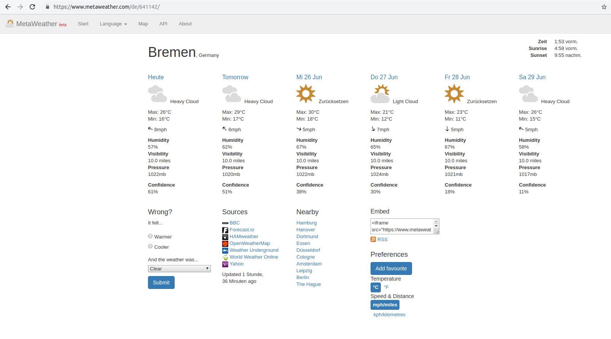
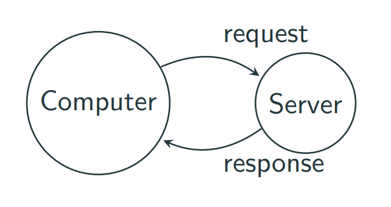
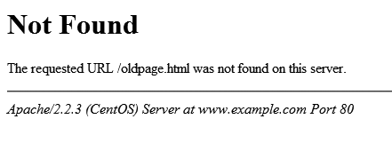

---
title: Getting data from the web
date: 2019-05-26
...

# The Internet
## The Internet


- Computers can communicate with each other

- Each computer has an IP address \vspace{2em}


The Internet [...] is the global system of interconnected computer networks
that use the Internet protocol suite (TCP/IP) to link devices worldwide.
@wiki:internet


## Servers & Clients

- Servers are computers which are dedicated to serve website data

- Clients are all devices which connect to those servers:
    * Computers
    * Notebooks
    * Smartphones
    * Smart home devices
    * ...


## What is a web browser?

- Software programs that allows you to search for and view various kinds of information on the Web.

:::notes
https://www.youtube.com/watch?v=z0HN-fG6oT4

Thus, browser mostly show websites.
:::


## The MetaWeather website

{width=200%}

:::notes
We are going to open the browser and got to the website:

https://www.metaweather.com/de/
:::


## URLs / Web addresses

- Computers and servers have IP addresses

- For servers IP addresses usually do not change

- But: those IP addresses are difficult to remember for humans


## URLs / Web addresses

- 209.85.227.104 is an IP

- www.google.com is a URL

- Both point to the same website


## DNS (Domain Name System)

- Works like a phone book

- Allows the browser to find the IP address for URLs

- The first step when typing a website name into the address bar

::: notes
DNS (Domain Name System) is a database that maintains the name of the website (URL) and the particular IP address it links to.
Every single URL on the internet has a unique IP address assigned to it. The IP address belongs to the computer which hosts the server of the website we are requesting to access. For an example, www.google.com has an IP address of 209.85.227.104. So if you’d like you can reach www.google.com by typing http://209.85.227.104 on your browser. DNS is a list of URLs and their IP addresses just like how a phone book is a list of names and their corresponding phone numbers.

The main purpose of DNS is human-friendly navigation. It is easier to remember the name of the website using an URL and let DNS do the work for us with mapping it to the correct IP.

Once the browser receives the correct IP address it will build a connection with the server that matches IP address to transfer information. Browsers use internet protocols to build such connections.
:::


## What happens when you enter a URL into your browser?

- DNS Lookup

- Request to the IP address

- Retrieving data from the server

- Rendering the data with the browser

:::notes
The browser will send a GET request asking for maps.google.com web page.
If you’re entering credentials or submitting a form this could be a POST request.

The server which receives the request from the browser, generates a response.
The response will be in a particular format (JSON, XML, HTML).

The server response contains the web page you requested as well as other information (e.g. the status code e.g. 200 OK).

The browser displays the HTML content. \vspace{1em}

@maneesha_2017
:::


## What happens when you enter a URL into your browser?

{width=60%}

  - You send a request to a web server to retrieve a website
  - You receive a response


## The server response: Content

Source code for websites is not written in Python, but usually in HTML.

We will not discuss HTML today, but how browsers can download it.


## The server response: Status codes

A response status code indicates whether a certain request has been successful.

- 200 OK
- 404 Not Found

\vspace{1em}
{width=80%}


:::notes
This is the link to the Wikipedia site where you can find an exhaustive list of status codes:

https://en.wikipedia.org/wiki/List_of_HTTP_status_codes
:::


# Web scraping

## Processing information from the web

Get the mean maximum temperature in Dortmund over the next three days!

1. Visit metaweather.com
2. Type Dortmund into the MetaWeather's search field
3. Note down the next three maximum temperatures and calculate the mean:

```{ .python .exec }
print((34 + 26 + 26) / 3)
```

::: notes
Osnabrück is not available at metaweather, and Dortmund is the closest other city.
:::


## But what about tomorrow?

- It's a slow manual process

- We can bookmark the page to make it a little faster

- Extracting the numbers is cumbersome and error prone


## Automating the process

- Request the website without a browser

- Parse the HTML document ourselves

- Every day the correct result

::: notes
unless the website changes
:::


## Web scraping

- Querying a website (or multiple websites) for data, e.g.
    - Weather
    - Watching prices for a product
    - Flight information
    - Stock market
    - ...

- This is how for example search engines and the internet archive get their data


## Web scraping in Python

We use **requests** to fetch website data:

```{ .python .exec }
import requests  # you need to install this!

webpage = requests.get('https://example.com').text
print(webpage[:90] + ' ...')
```

:::notes
Install requests by running `pip3 install requests`.
(See the homework sheet for more information)

You can find the awesome documentation here:
http://docs.python-requests.org
:::


## Parsing HTML

**Beautiful Soup** can parse HTML:

```{ .python .exec }
import requests
from bs4 import BeautifulSoup

webpage = requests.get('https://example.com').text
soup = BeautifulSoup(webpage, 'html.parser')
print(soup.title.string)
```

:::notes
If you want to run this example, you also need to install BeautifulSoup
:::


## Parsing HTML

- **Beatiful Soup** can make HTML code easily accessible

- But for complex websites that is still cumbersome

::: notes
Still, downloading a website's source code and parsing it is often a good (if not the only) way to extract information automatically.
:::


## Intermezzo: Web scraping rules

- Check if the website allows to scrape it (extensively)
    
    -  A lot of websites provide more information on `www.website.com/robots.txt`

- Do not send request too often!
    
    - -> you don't want to crash a website/server

::: notes
You might laugh at crashing websites/servers, but small websites often cannot handle big loads.
While it is unlikely that you alone bring down a website, a whole class of students, or a few hundred people just visiting a website at the same time very often cause troubles for small websites, even today.
It is just a convention (and for many websites even a strict rule!) not to scrape them too heavily (or not at all).
:::


# Web APIs
## APIs - Application Programming Interfaces

- Alternative to normal websites

- Especially made for requesting information

:::notes
 A video about APIs:

https://www.youtube.com/watch?v=s7wmiS2mSXY
:::


## Planning & making an API request

1. Explore website in browser

2. Check API documentation

3. Determine API query

4. Send a request

5. Receive data

6. Save data

7. Parse data & process data (inspect, plot, analyze, etc.)

:::notes
Make sure you only send your request when necessary i.e. only download data once and not every time you are processing your data.

The same rules apply as for web scraping!
Many websites offer guidelines on how often to query them.
Their administrators might otherwise block you!
:::


## Back to the weather

- Reminder: We want the mean maximum weather for the next three days in Dortmund.

- MetaWeather offers an API with JSON
  - [https://www.metaweather.com/api](https://www.metaweather.com/api)

- We don't need to parse HTML!

- But we need the "Where On Earth ID" for Dortmund


## HTTP via requests in Python

```{ .python .exec }
import requests 

url = 'https://www.metaweather.com/api/'
url += 'location/search/?query=Dortmund'
response = requests.get(url).text
print(response)
```


## The response can be parsed as JSON

We can extract the "Where On Earh ID":
 
```{ .python .exec}
import requests

url = 'https://www.metaweather.com/api/'
url += 'location/search/?query=Dortmund'
response = requests.get(url).json()
woeid = response[0]['woeid']

print(woeid)
```


## Checking the response status

We can find out the status of the response:
 
```{ .python .exec}
import requests

url = 'https://www.metaweather.com/api/'
url += 'location/search/?query=Dortmund'
response = requests.get(url)
status = response.status_code

print(status)
```

:::notes
The status code of the response is 200 OK.
:::


## Query the weather data

We can now use the WOEID 645458 to get the data for Dortmund:

```{ .python .exec}
import requests

url = 'https://www.metaweather.com/api/'
url += 'location/645458'
forecast = requests.get(url).json()
print(forecast)
```


## Exploring the data

```output
{
  "consolidated_weather": [
    {
      "weather_state_name": "Light Cloud",
      "applicable_date": "2019-06-27",
      "max_temp": 26.755000000000003,
      ...
    },
    {
      "weather_state_name": "Light Cloud",
      "applicable_date": "2019-06-28",
      "max_temp": 25.130000000000003,
      ...
    },
    ...
```

::: notes
The data here was shortened to the relevant parts.
It might also not reflect what your query returns, as it is from Tue, 25th June and updated frequently.

The forecast information is aggregated from multiple sources, hence "consolidated".
:::


## Extracting the data

```{ .python .exec }
import requests

url = 'https://www.metaweather.com/api/'
url += 'location/645458'

forecast = requests.get(url).json()
next_3_days = forecast['consolidated_weather'][1:4]

print(sum([day['max_temp'] for day in next_3_days]) / 3)
```

::: notes
Success!
Now this will always return the correct results without any manual steps involved!
:::


## More tools for web scraping

- https://selenium-python.readthedocs.io/

- https://mechanicalsoup.readthedocs.io/en/stable/


## Organizational

- You should have received an email to the online evaluation of the course

- I very much appreciate your evaluation!

- It is good for improving myself and the lecture


## Tips for your homework

Let's look at the website together.